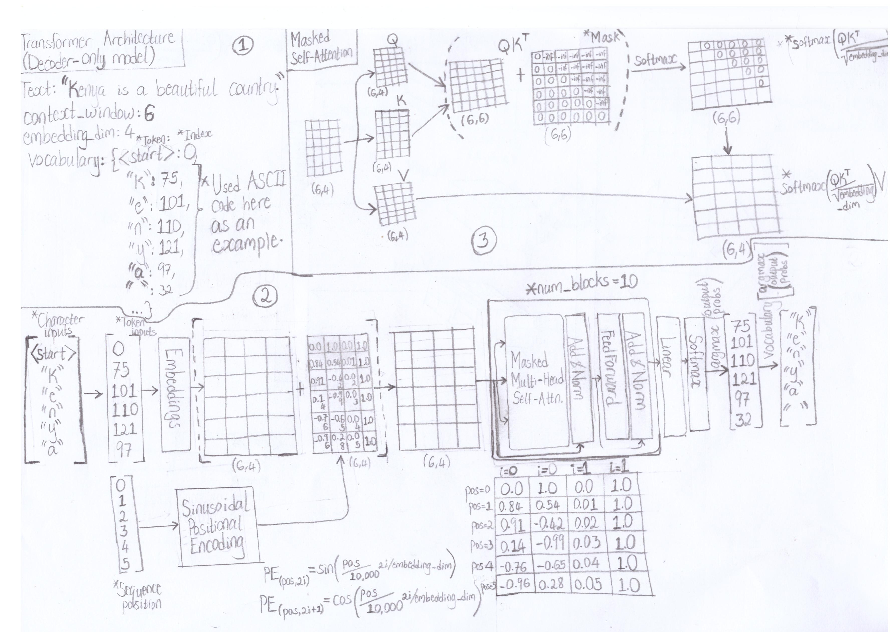
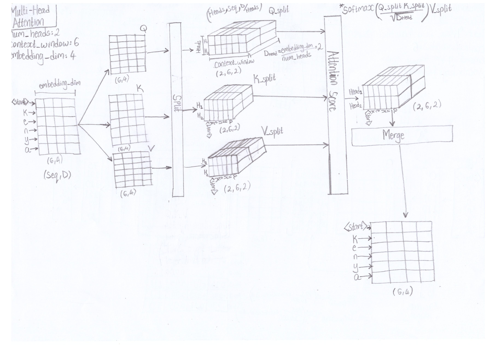
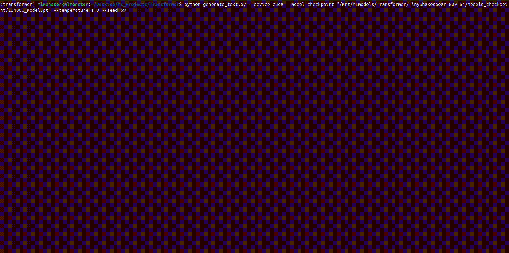

# Basic Transformer-Architecture Implementation
## Description
This is a basic implementation of the transformer-architecture (**decoder-only model**) made for learning purposes. It works like GPT-1, but doesn't strictly follow its implementation.

## How it works
Before training a language model, one has to generate the dataset that the model will use. This can be done by breaking down text into **tokens**, smallest unit of information, specifically character-based tokens that includes uppercase and lowecase letters, numbers, punctuation marks and special characters. For example the text "Kenya is a beautiful country." can be broken down into ['K', 'e', 'n', 'y', 'a', ' ', 'i', 's', ' ', 'a', ' ', 'b', 'e', 'a', 'u', 't', 'i', 'f', 'u', 'l', ' ', 'c', 'o', 'u', 'n', 't', 'r', 'y', '.']. All of the unique characters can then form the **vocabulary** of the dataset e.g [' ', '.', 'K', 'a', 'b', 'c', 'e', 'f', 'i', 'l', 'n', 'o', 'r', 's', 't', 'u', 'y']. Each character-based token derived from the previous steps can then be mapped to an integer value by getting the index of then from the generated vocabulary e.g [2, 6, 10, 16, 3, 0, 8, 13, 0, 3, 0, 4, 6, 3, 15, 14, 8, 7, 15, 9, 0, 5, 11, 15, 10, 14, 12, 16, 1].

The resulting integer values will then be passed into the transformer model, which involves indexing a learnable **Embedding** object, a simple lookup table that stores vectors of a fixed dictionary and size, to derive a sequence of vectors of dimension D. However, these sequence of vectors can't convey important information such as their position in the sequence in the model. To alleviate this issue, **Sinusoidal Positional embedding** vector(s) of dimension D is generated to capture the positional information separately and added to the sequence of embedding vectors.

The resulting sequence of vectors is then passed to the model which contains a stack of **Masked Multi-Head Self-Attention** and **Position-wise Feedforward** layers. The **self-attention** layer allows the model to weigh the importance of each of the sequence of vectors amongst themselves. A **mask** also needs to be added in the attention operation to force each sequence of tokens to only consider the previous tokens before it. In addition, instead of performing a single attention function, a **multi-head** attention is used to increase the model's capacity to focus on multiple tokens at different positions to better help do it's task. This is implemented by logically spliting the dimension of vectors N ways for N heads and applying the attention mechanism on the split data at the same time, afterwards the split data is merged together for the next layer. The final layer in the stack is the **position-wise feedforward** layer, it processes the sequence of vectors independently of each other to better transform them into a representation that can be used in the last layer of the model.





## Implementation
The project includes the following functionalities:
- Code to pre-train Decoder-only model (First phase in training Langunge Models for generating task).
- Script to generate dataset from .txt files (Uses only Character-Based tokenization).
- Script to generate text using saved models (Can only autocomplete texts).

## Requirements
- Anaconda (Optional)
- Python 3

## Installing.
1. (Optional) Install [Anaconda](https://docs.anaconda.com/) on your machine.
    - Create anaconda environment:
    ```
    conda create --name <env_name> python=3.12
    ```
    - To activate anaconda environment, if not already activated:
    ```
    conda activate <env_name>
    ```
2. (If not installed) Install [Pytorch 2.5](https://pytorch.org/get-started/locally/) based on your hardware requirements and preferences.
3. Install Python depencies:
    ```
    pip install -r requirements.txt
    ```

## Running model.
### Generating training dataset.
To generate dataset you need a .txt file (Uses "utf-8" encoding), run the following to generate a .json file.
```
python generate_nlp_dataset.py --txt-path "<Directory path to file>/<filename>.txt" --out-path "<Directory path for saved file>/<filename>.json" --dataset-ratio <Ratio for train:test split> --print-instant <Boolean flag to instantly print all text at once>
```

### Creating config file.
Before a model can be trained, you will be required to generate a config file (config.json) containing information about the model parameters and other information such as learning rate. It should look like this, adjust accordingly:
```
{
    "num_heads": 32,
    "num_blocks": 10,
    "embedding_dim": 512,
    "hidden_dim": 2048,
    "context_window": 100,
    "activation_type": "gelu",
    "max_global_steps": 100000,
    "model_lr": 1e-4
}
```

#### Parameter details:
- num_heads: Number of attention heads, value should be able to divide **embedding_dim** with no remainder.
- num_blocks: Number of transformer blocks in model.
- embedding_dim: Dimension of input vector before being processed in each layer.
- hidden_dim: Dimension of hidden vector during processing in each layer, can be greater than **embedding_dim**.
- context_window: Sequence size of dataset (Max size of tokens a model can process at once).
- activation_type: Activation types used in each layer(Supported: "gelu", "lrelu", "relu", "sigmoid", "tanh").
- max_global_steps: Maximum global steps for training dataset before stopping.
- model_lr: Learning rate for training dataset.

### Training model.
To train a model using the generated json dataset, and config file, run the following, adjust accordingly:
```
python pretrain_decoder_transformer.py --device <Device to train on: cpu/cuda> --use-activation-checkpoint <Boolean flag to trade-off compute speed for memory, bigger model/batch sizes for slower training> --dataset-path "<Directory path to dataset>/<filename>.json" --test-model <Boolean flag to support testing model using testing data during each checkpointing step> --temperature <Float value; parameter determining how model generates text> --checkpoint-steps <Steps to be performed before saving model and optionally testing it>  --model-checkpoint "<Optional filepath to a saved model checkpoint, in cases of resuming training or finetuning>" --load-optim <Boolean flag for whether to load optimizer weights when loading models, excluded when finetuning> --resume-training <Boolean flag to resume using saved global step parameter> --config-path "<File path to config file used for training>" --out-dir "<Directory path for logs and model checkpoints>" --tr-batch-size <Batch size for training dataset> --tst-batch-size <Batch size for testing dataset>
```

## Example.
I was able to train a model using [tinyshakespeare](https://raw.githubusercontent.com/karpathy/char-rnn/master/data/tinyshakespeare/input.txt) dataset with a context size of **800** character-tokens, on a **RTX 3080** 10GB GPU. Below is a video of the model at work.



## Learning Resources.
- [Attention Is All You Need](https://arxiv.org/abs/1706.03762)
- [The Illustrated Transformer](http://jalammar.github.io/illustrated-transformer/)
- [Visualizing and Explaining Transformer Models From the Ground Up](https://deepgram.com/learn/visualizing-and-explaining-transformer-models-from-the-ground-up)
- [Word, Subword, and Character-Based Tokenization: Know the Difference](https://towardsdatascience.com/word-subword-and-character-based-tokenization-know-the-difference-ea0976b64e17)
- [Transformers Explained Visually (Part 3): Multi-head Attention, deep dive](https://towardsdatascience.com/transformers-explained-visually-part-3-multi-head-attention-deep-dive-1c1ff1024853)
- [LLM Temperature](https://www.hopsworks.ai/dictionary/llm-temperature)
- [A Gentle Introduction to Positional Encoding in Transformer Models, Part 1](https://machinelearningmastery.com/a-gentle-introduction-to-positional-encoding-in-transformer-models-part-1/)
